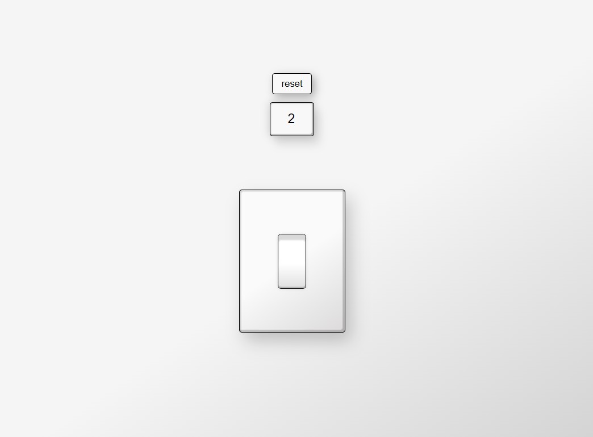

# interuptor-v2.0
 Um interruptor que muda o tema da página e contabiliza quantas vezes foi clicado. 
 - Pequeno projeto para treinar minhas habilidades básicas de CSS e JavaScript.
 - <a target="_blank" href="https://filipemartins-dev.github.io/interuptor-v2.0/">Entrar na página</a> 

 
